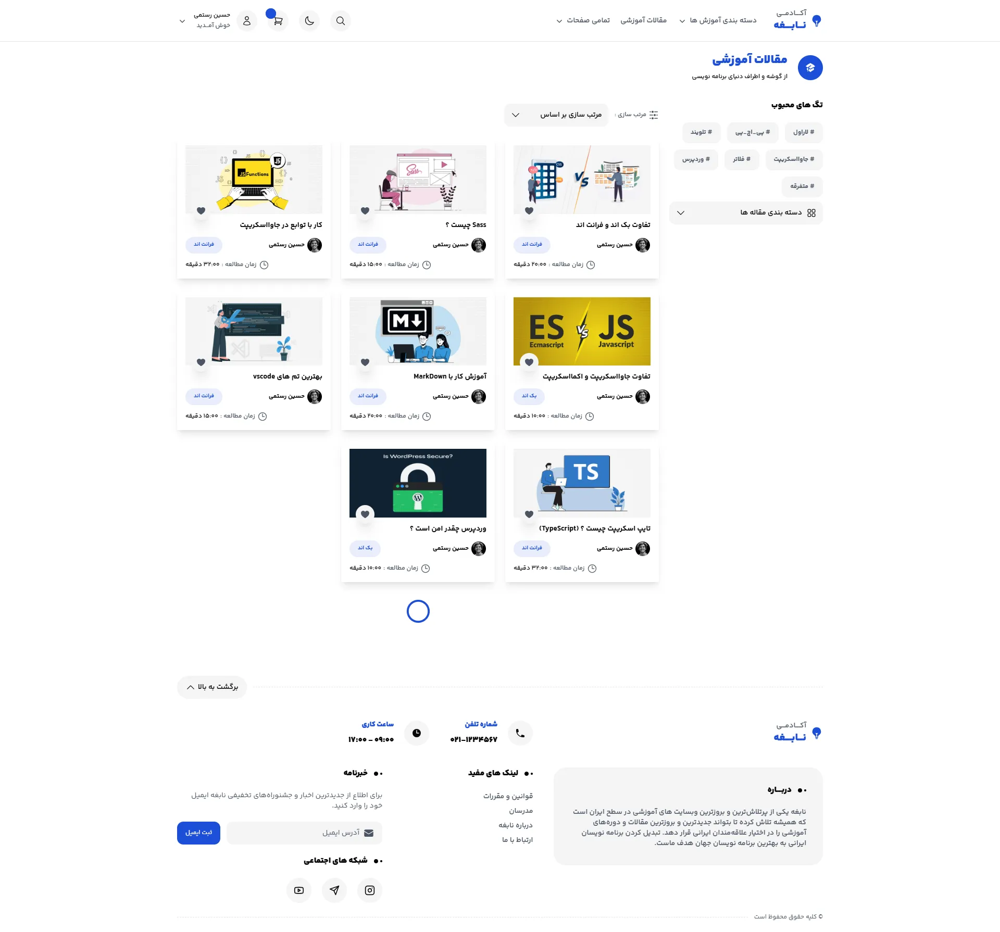
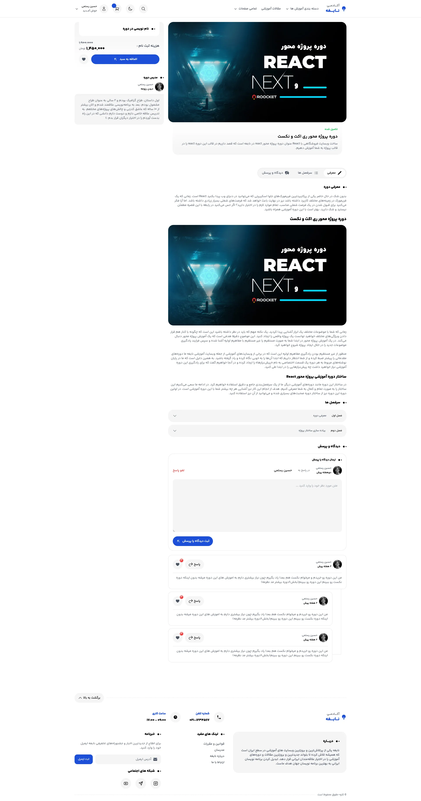
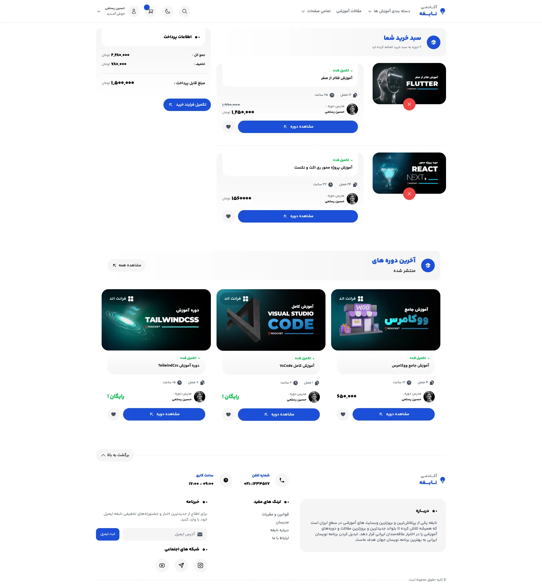

# Project Name
Genius Academy

## About
The educational site of Genius Academy is about programmingeducation.
This site has an attractive user interface and has twothemes, light and
dark, and is also fully responsive. This project wasdeveloped using
Tailwind Css, React Js.

## Features
- Different pages
- Dark and light themes
- Responsive
- Attractive user interface

## Tech Stack
- Tailwind CSS
- React

## Screenshots

  
  
  
  

## Installation

## Folder Structure

## Live Demo
[Genius Academy](https://hr-genius-academy.netlify.app)
